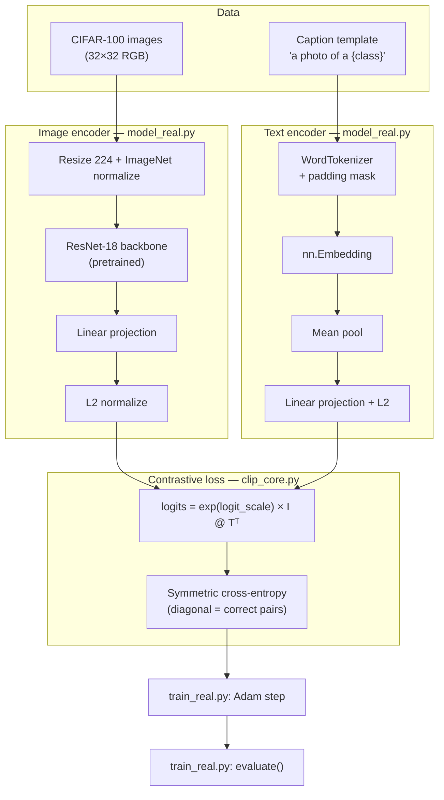

# CLIP — learn by building

Educational walkthrough of CLIP: contrastive image–text training on real CIFAR-100 photos.

## Where to start (file anchors)

Read in this order:


| Step | File                                            | Role                                                     |
| ---- | ----------------------------------------------- | -------------------------------------------------------- |
| 1    | `[clip_core.py](clip_core.py)`                  | **Loss anchor** — symmetric InfoNCE (the CLIP objective) |
| 2    | `[model_real.py](model_real.py)`                | **Model anchor** — ResNet-18 + text encoder architecture |
| 3    | `[dataset_cifar.py](dataset_cifar.py)`          | **Data anchor** — CIFAR-100 → (image, caption tokens)    |
| 4    | `[train_real.py](train_real.py)`                | **Training anchor** — full train loop (`train()`)        |
| 5    | `[train_real.py](train_real.py)` → `evaluate()` | **Testing anchor** — validation metrics + heatmaps       |
| 6    | `[sanity_check.py](sanity_check.py)`            | **Sanity anchor** — automated checks vs submodule        |


```text
clip_core.py      ← WHAT we optimize (contrastive loss)
model_real.py     ← WHO learns (dual encoders)
dataset_cifar.py  ← WHAT we feed in (image–text pairs)
train_real.py     ← HOW we train + HOW we measure success
sanity_check.py   ← verify against external/openai-clip
```

### Official reference (submodule, not our code)

`[external/openai-clip/](external/openai-clip/)` — git submodule pointing at [github.com/openai/CLIP](https://github.com/openai/CLIP).

After cloning:

```bash
git submodule update --init --recursive
```

Compare our files with theirs:


| Our file           | OpenAI equivalent                                         |
| ------------------ | --------------------------------------------------------- |
| `clip_core.py`     | `external/openai-clip/clip/model.py` (loss + logit_scale) |
| `model_real.py`    | `external/openai-clip/clip/model.py` (encoders)           |
| `dataset_cifar.py` | their inference preprocess + `clip.tokenize()`            |


The submodule is a **read-only reference** — it does not run our training. It helps you see how the real system differs (ViT, Transformer, BPE, pretrained weights).

## Pipeline




## Commands

```bash
cd ~/ml_learning
pixi install

pixi run clip-smoke    # model shape check (no data download)
pixi run clip-sanity   # automated checks vs openai-clip submodule
pixi run clip-train    # train + validate on CIFAR-100
```

## Testing guide

### 1. Smoke test (model only)

```bash
pixi run clip-smoke
```

Expect: `logits shape: [4, 4]` and a loss value. Confirms PyTorch + model compile.

### 2. Train + validate (main lesson)

```bash
pixi run clip-train
```

First run downloads CIFAR-100 (~170 MB) into `CLIP/data/`.


| Metric     | Before       | After (typical) |
| ---------- | ------------ | --------------- |
| `val_loss` | ~2–3         | decreases       |
| `val_acc`  | ~6% (random) | **50–70%+**     |


Open after training:

- `outputs/similarity_before.png` vs `similarity_after.png` — diagonal should brighten
- `outputs/training_curves.png` — loss down, accuracy up

### 3. Automated sanity check (recommended)

```bash
pixi run clip-sanity
```

Checks submodule, loss formula vs `external/openai-clip/clip/model.py`, data pipeline, and one train step.

### 4. Data sanity check (manual)

```bash
pixi shell
cd CLIP
python -c "
from dataset_cifar import CIFAR100CLIPDataset, WordTokenizer
from torchvision.datasets import CIFAR100
meta = CIFAR100(root='data', train=True, download=False)
tok = WordTokenizer(meta.classes)
ds = CIFAR100CLIPDataset('data', train=True, tokenizer=tok, class_names=meta.classes, max_samples=8)
img, tok_ids, mask, label = ds[0]   # single sample — label is int, not a batch
print('image:', img.shape)
print('caption:', tok.caption_for_label(label, meta.classes))
"
```

### GPU

See `~/AGENTS.md` § GPU. Quick check:

```bash
nvidia-smi
pixi run python -c "import torch; print(torch.cuda.is_available())"
```

When CUDA is available, `train_real.py` uses `device=cuda`, batch 64, 4 data workers.

## What we teach vs OpenAI CLIP


| Piece         | This repo                | OpenAI CLIP (`external/openai-clip`) |
| ------------- | ------------------------ | ------------------------------------ |
| Loss          | Same symmetric InfoNCE   | Same                                 |
| Image encoder | ResNet-18                | ViT-B/32 or ResNet-50                |
| Text encoder  | Word mean-pooling        | 12-layer Transformer + BPE           |
| Data          | CIFAR templated captions | 400M web pairs                       |
| Goal          | Learn the **recipe**     | Production zero-shot model           |


Paper: [Learning Transferable Visual Models From Natural Language Supervision](https://arxiv.org/abs/2103.00020)

## Troubleshooting


| Issue                             | Fix                                                                             |
| --------------------------------- | ------------------------------------------------------------------------------- |
| Submodule empty                   | `git submodule update --init --recursive`                                       |
| Sanity check fails                | `pixi run clip-sanity` — read which ✗ line failed                               |
| `pixi install` fails (no GPU)     | Remove `[tool.pixi.system-requirements] cuda` or set `CONDA_OVERRIDE_CUDA=12.9` |
| `torch.cuda.is_available()` false | Re-run `pixi install`; check `pyproject.toml` CUDA settings + AGENTS.md         |
| Training slow on CPU              | Use GPU, or lower `train_max` / `epochs` in `RealTrainConfig`                   |
| Low accuracy                      | Raise `train_max` to 20000, `epochs` to 15                                      |


