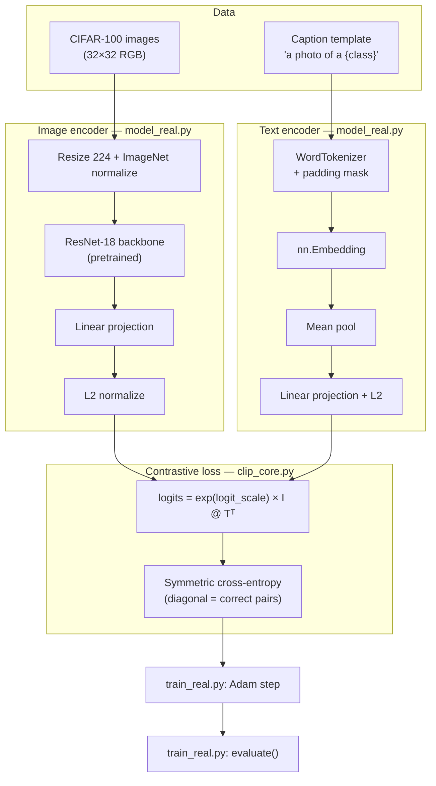

# CLIP — learn by building

Educational walkthrough of CLIP: contrastive image-text training on real CIFAR-100 photos.

## Start Here

The highest-level anchor is [`train_real.py`](train_real.py).

Read that file first because it shows the full user journey:

```text
train_real.py
├── train()      ← training process: CLIP Steps 1-6
├── evaluate()   ← testing process:  CLIP Steps 1-5
└── plot_*()     ← visual proof: heatmaps + curves
```

Everything else is a component called by `train_real.py`.

## Big Map

CLIP has two related flows:

| Flow | Steps | Purpose | Anchor |
|------|-------|---------|--------|
| **Testing / validation** | Steps 1-5 | Measure alignment without changing weights | `evaluate()` in [`train_real.py`](train_real.py) |
| **Training** | Steps 1-6 | Measure loss, then update model weights | `train()` in [`train_real.py`](train_real.py) |

```text
Step 1  DATA          dataset_cifar.py
Step 2  ENCODE IMAGE  model_real.py → ImageEncoder
Step 3  ENCODE TEXT   model_real.py → TextEncoder
Step 4  SCORE         clip_core.py
Step 5  LOSS          clip_core.py
Step 6  UPDATE        train_real.py only (backward + optimizer.step)
```

Testing stops after Step 5. Training adds Step 6.

## Component Anchors

Use this table when you want to zoom into one part of the system:

| Component | File | What To Read |
|-----------|------|--------------|
| **Top-level guide** | [`train_real.py`](train_real.py) | `train()` first, then `evaluate()` |
| **Data** | [`dataset_cifar.py`](dataset_cifar.py) | `CIFAR100CLIPDataset.__getitem__()` and `build_cifar_loaders()` |
| **Model** | [`model_real.py`](model_real.py) | `RealCLIP.forward()`, `ImageEncoder`, `TextEncoder` |
| **Loss** | [`clip_core.py`](clip_core.py) | `clip_contrastive_loss()` |
| **Sanity check** | [`sanity_check.py`](sanity_check.py) | automated checks vs OpenAI CLIP |
| **Official reference** | [`external/openai-clip/`](external/openai-clip/) | upstream OpenAI implementation |

### Official reference (submodule, not our code)

[`external/openai-clip/`](external/openai-clip/) — git submodule pointing at [github.com/openai/CLIP](https://github.com/openai/CLIP).

After cloning:

```bash
git submodule update --init --recursive
```

Compare our files with theirs:


| Our file           | OpenAI equivalent                                         |
| ------------------ | --------------------------------------------------------- |
| `clip_core.py`     | `external/openai-clip/clip/model.py` (loss + logit_scale) |
| `model_real.py`    | `external/openai-clip/clip/model.py` (encoders)           |
| `dataset_cifar.py` | their inference preprocess + `clip.tokenize()`            |


The submodule is a **read-only reference** — it does not run our training. It helps you see how the real system differs (ViT, Transformer, BPE, pretrained weights).

## Pipeline



## Testing Process: Steps 1-5

Testing answers: **does the current model align matching image-text pairs?**

Testing does **not** update weights.

```text
evaluate(model, val_loader, device)
├── Step 1  DATA          get validation batch
├── Step 2  ENCODE IMAGE  model.encode_image(...)
├── Step 3  ENCODE TEXT   model.encode_text(...)
├── Step 4  SCORE         similarity matrix: I @ T.T
├── Step 5  LOSS          symmetric contrastive loss
└── Metrics               val_loss, image→text acc, text→image acc
```

Run the fast automated test:

```bash
cd ~/ml_learning
pixi run clip-sanity
```

What it checks:

- the OpenAI CLIP submodule exists
- our logits formula matches OpenAI CLIP
- the model forward pass works
- the CIFAR data pipeline works
- one tiny training step is differentiable

## Training Process: Steps 1-6

Training answers: **can the model improve from data?**

Training includes all testing steps, then adds the update step.

```text
train(cfg)
├── setup                 config, seed, device
├── Step 1  DATA          build train/val loaders
├── setup                 build RealCLIP + Adam optimizer
├── Steps 1-5             baseline evaluate() before training
├── epoch loop
│   ├── Step 1  DATA      get train batch
│   ├── Step 2  IMAGE     ResNet-18 → image embedding
│   ├── Step 3  TEXT      word embeddings → text embedding
│   ├── Step 4  SCORE     N×N similarity matrix
│   ├── Step 5  LOSS      diagonal positives, off-diagonal negatives
│   └── Step 6  UPDATE    loss.backward() + optimizer.step()
├── Steps 1-5             validate after each epoch
└── Steps 1-5             final evaluate + save plots
```

Run training:

```bash
cd ~/ml_learning
pixi run clip-train
```

First run downloads CIFAR-100 (~170 MB) into `CLIP/data/`.

Expected direction:

| Metric | Before | After (typical) |
|--------|--------|-----------------|
| `val_loss` | ~2-4 | decreases |
| `val_acc` | near random | **50-70%+** |

Open after training:

- `outputs/similarity_before.png` vs `outputs/similarity_after.png`
- `outputs/training_curves.png`

## Commands

```bash
cd ~/ml_learning
pixi install

pixi run clip-smoke    # model shape check (no data download)
pixi run clip-sanity   # automated checks vs openai-clip submodule
pixi run clip-train    # train + validate on CIFAR-100
```

## Manual Checks

### Smoke test

```bash
pixi run clip-smoke
```

Expect: `logits shape: [4, 4]` and a loss value. Confirms PyTorch + model compile.

### Automated sanity check

```bash
pixi run clip-sanity
```

Checks submodule, loss formula vs `external/openai-clip/clip/model.py`, data pipeline, and one train step.

### Data sanity check

```bash
pixi shell
cd CLIP
python -c "
from dataset_cifar import CIFAR100CLIPDataset, WordTokenizer
from torchvision.datasets import CIFAR100
meta = CIFAR100(root='data', train=True, download=False)
tok = WordTokenizer(meta.classes)
ds = CIFAR100CLIPDataset('data', train=True, tokenizer=tok, class_names=meta.classes, max_samples=8)
img, tok_ids, mask, label = ds[0]   # single sample — label is int, not a batch
print('image:', img.shape)
print('caption:', tok.caption_for_label(label, meta.classes))
"
```

### GPU

See `~/AGENTS.md` § GPU. Quick check:

```bash
nvidia-smi
pixi run python -c "import torch; print(torch.cuda.is_available())"
```

When CUDA is available, `train_real.py` uses `device=cuda`, batch 64, 4 data workers.

## What we teach vs OpenAI CLIP


| Piece         | This repo                | OpenAI CLIP (`external/openai-clip`) |
| ------------- | ------------------------ | ------------------------------------ |
| Loss          | Same symmetric InfoNCE   | Same                                 |
| Image encoder | ResNet-18                | ViT-B/32 or ResNet-50                |
| Text encoder  | Word mean-pooling        | 12-layer Transformer + BPE           |
| Data          | CIFAR templated captions | 400M web pairs                       |
| Goal          | Learn the **recipe**     | Production zero-shot model           |


Paper: [Learning Transferable Visual Models From Natural Language Supervision](https://arxiv.org/abs/2103.00020)

## Troubleshooting


| Issue                             | Fix                                                                             |
| --------------------------------- | ------------------------------------------------------------------------------- |
| Submodule empty                   | `git submodule update --init --recursive`                                       |
| Sanity check fails                | `pixi run clip-sanity` — read which ✗ line failed                               |
| `pixi install` fails (no GPU)     | Remove `[tool.pixi.system-requirements] cuda` or set `CONDA_OVERRIDE_CUDA=12.9` |
| `torch.cuda.is_available()` false | Re-run `pixi install`; check `pyproject.toml` CUDA settings + AGENTS.md         |
| Training slow on CPU              | Use GPU, or lower `train_max` / `epochs` in `RealTrainConfig`                   |
| Low accuracy                      | Raise `train_max` to 20000, `epochs` to 15                                      |


